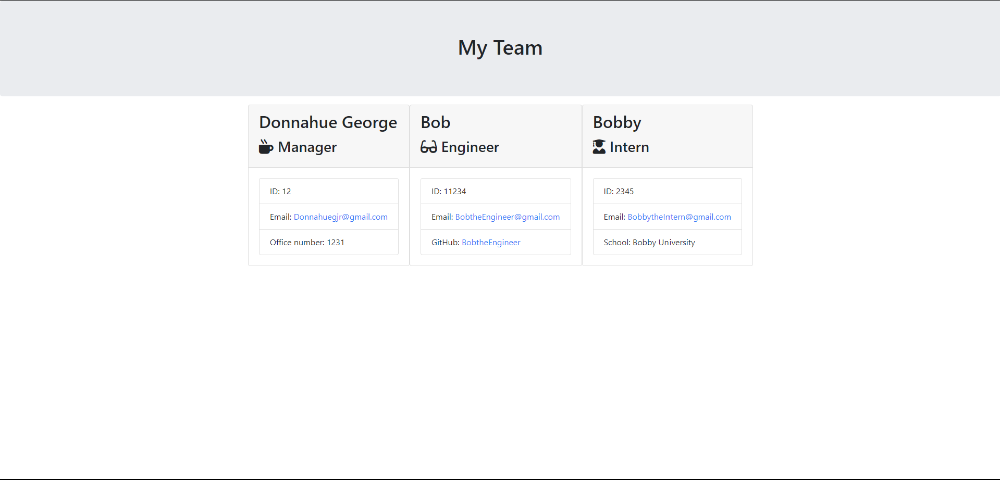

# Team Profile Generator 

When a user needs to fill out a profile for their staff, they can run this program, answer the following questions, then a new HTML page is created and styled for their entire team.

# Tables of Contents

- [Installation](#installation)
- [Usage](#usage)
- [Contributing](#contributing)
- [Tests](#tests)
- [Questions](#questions)
- [Credits](#credits)
- [Application](#application)

# Installation

You need to install npm, node, and the inquirer npm package.

# Usage

run "npm start" in the terminal to use the application.

# Contributing

There are no contributings to this project.

# Test

you can run "npm test" in order to test if the constructors are working properly.

# License

There are no licenses for this project

# Questions

If you have any questions, feel free to email me at Donnahuegjr@gmail.com.

# Credits

Github: www.github.com/Latinobull
Copyright Donnahue George. All Rights Reserved.

# Application

